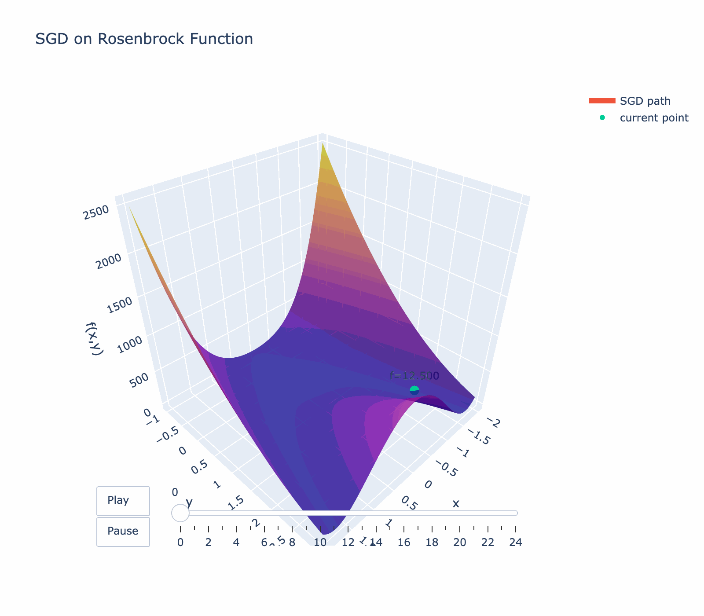

# Gradient Descent Visualization

This notebook helps visualize gradient descent, assuming a loss function represented as a 3D surface. 

Surfaces are implemented as python classes and can be found in `surfaces.py`. Gradients are manually derived from the original function
for each different surface. 

Plotly is used to generate and animate 3D visuals.

